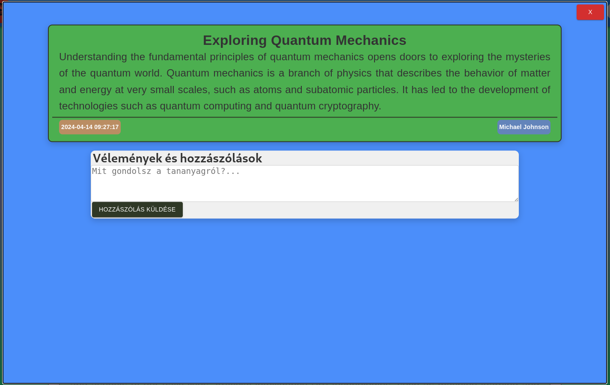
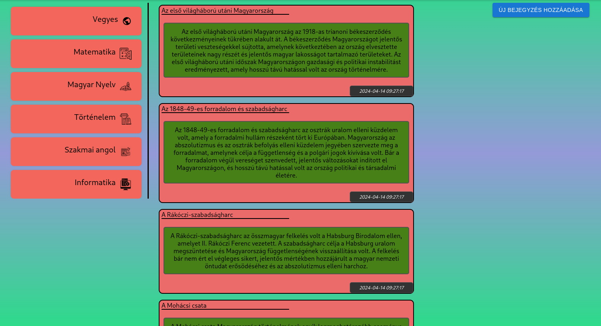
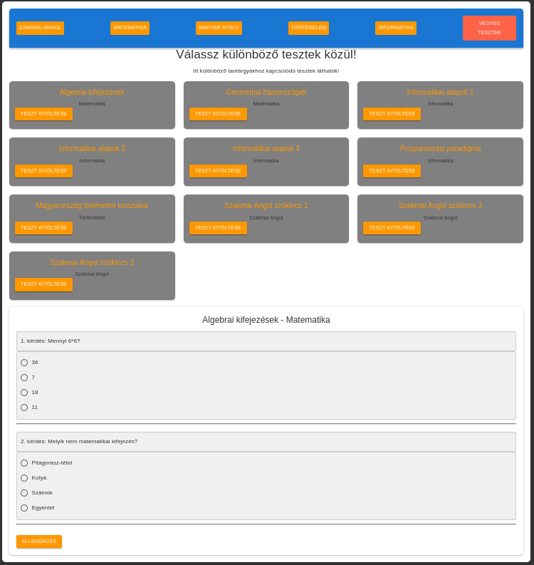
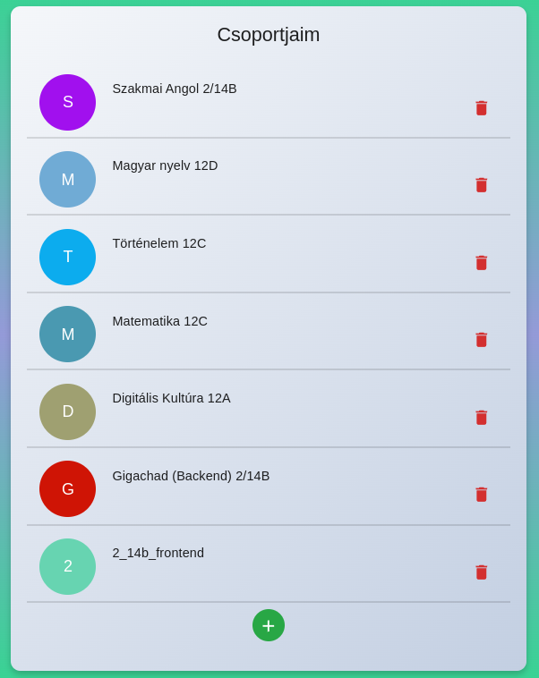
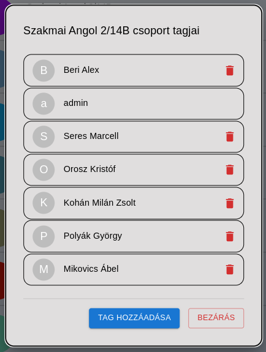
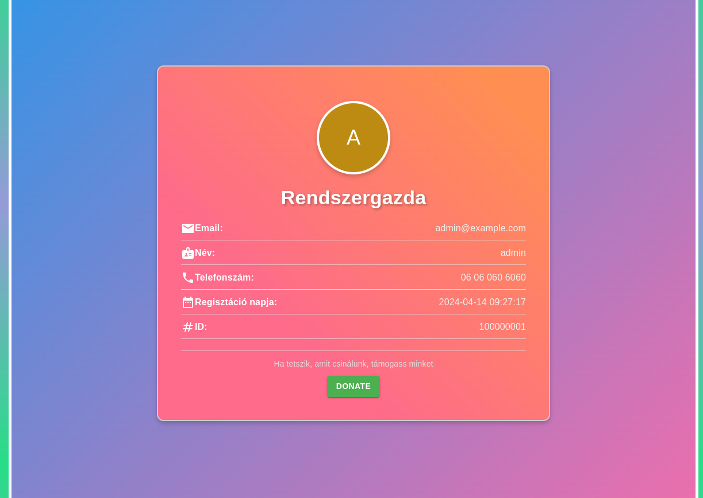
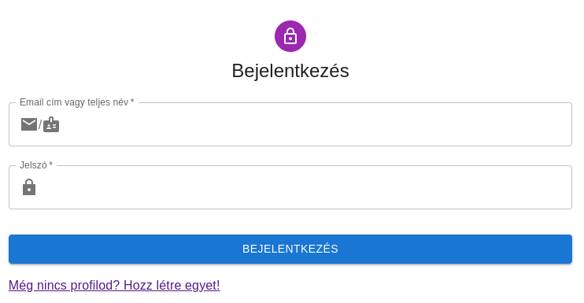
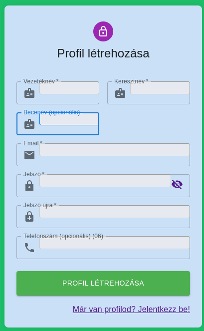
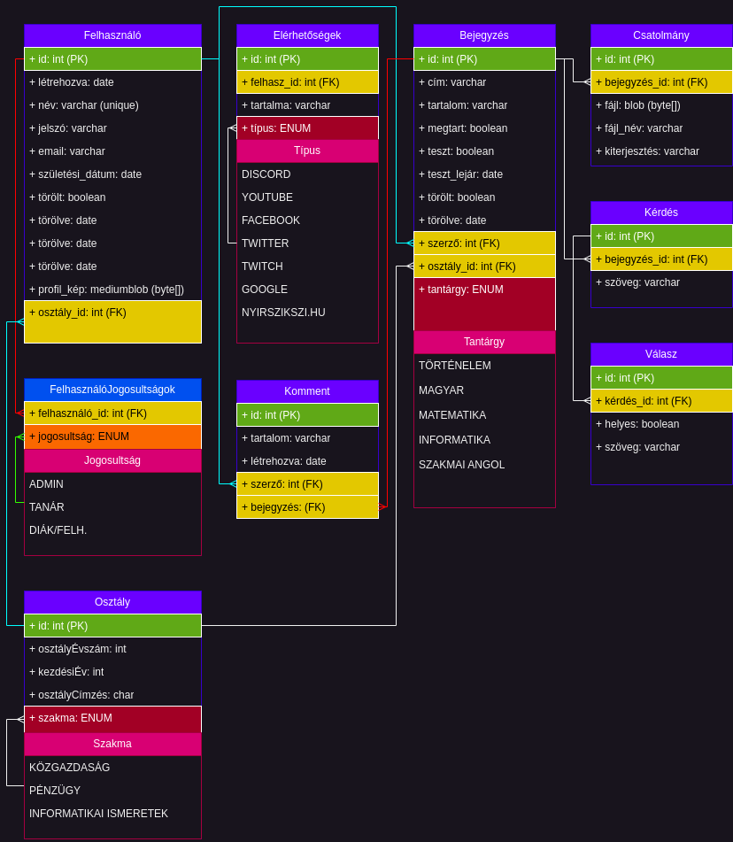

# Fejlesztői dokumentáció

## Entitások

- Tananyagok oldal:

- Kiválasztott bejegyzés:

- Főoldal:

- Tesztek oldal:

- Csoportjaim oldal:

- Kiválasztott csoport tagjai:

- Profilom oldal:

- Beállítások oldal:

- Bejelentkező oldal:

- Regisztrációs oldal:

---

- [Answer](./backend-dev-docs/entities/entity-answer.md)
- [Attachment](./backend-dev-docs/entities/entity-attachment.md)
- [Availability](./backend-dev-docs/entities/entity-availability.md)
- [Comment](./backend-dev-docs/entities/entity-comment.md)
- [Entry](./backend-dev-docs/entities/entity-entry.md)
- [Group](./backend-dev-docs/entities/entity-group.md)
- [Question](./backend-dev-docs/entities/entity-question.md)
- [User](./backend-dev-docs/entities/entity-user.md)

## API Dokumentáció

[Elérhetőség kezelő API](backend-dev-docs/apis/availability-api.md)

[Komment kezelő API](backend-dev-docs/apis/comment-api.md)

[Bejegyzés kezelő API](backend-dev-docs/apis/entry-api.md)

[Csoport kezelő API](backend-dev-docs/apis/group-api.md)

[Biztonság kezelő API](backend-dev-docs/apis/security-api.md)

[Felhasználó kezelő API](backend-dev-docs/apis/user-api.md)

## Adatbázis terv

A backend fejlesztői dokumentációs mappában megtalálható db mappában megtalálható a draw.io-val készített [adatbazis_terv.drawio](./db/adatbazis_terv.drawio) forrás fájl is.
