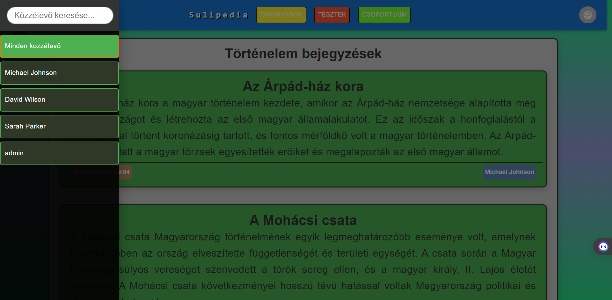

## Tantárgyak Oldal Felhasználói Dokumentáció

### Áttekintés

A Tantárgyak Oldal lehetővé teszi a felhasználók számára, hogy megismerjék és böngésszék az elérhető tantárgyakat. Az oldal segítségével a felhasználók könnyen tájékozódhatnak az egyes tantárgyakról, megismerhetik a leírásukat és elérhetik a részletes információkat.

---

### Használat

1. **Tantárgyak Böngészése**: Tekintsd át az elérhető tantárgyakat a kártyák segítségével.
   
2. **Részletes Információk**: Kattints a "Részletek" gombra, hogy megnézhess minden különböző posztot az adott tantárgyból.
---

### Felhasználói Felület

Az oldal felhasználóbarát felülettel rendelkezik, amely lehetővé teszi a tantárgyak böngészését könnyen és gyorsan. Az alábbiakban néhány jellemző a felhasználói felületről:

- **Kártyák**: Minden tantárgy egy kártyán jelenik meg, amely tartalmazza a tantárgy címét, ikonját és leírását.

- **Részletes Információk**: A kártyák alatt található "Részletek" gomb segítségével a felhasználók megnézhetik az összes bejegyzést az adott tantárgyról.

- **Reszponzív Design**: Az oldal reszponzív dizájnja lehetővé teszi a használatát különböző eszközökön, például asztali számítógépeken, laptopokon, táblagépeken és mobiltelefonokon is.

---

### Fontos Megjegyzések 
- Használd a navigációs linket az egyes tantárgyakhoz való gyors navigáláshoz és részletes információkhoz való hozzáféréshez.

