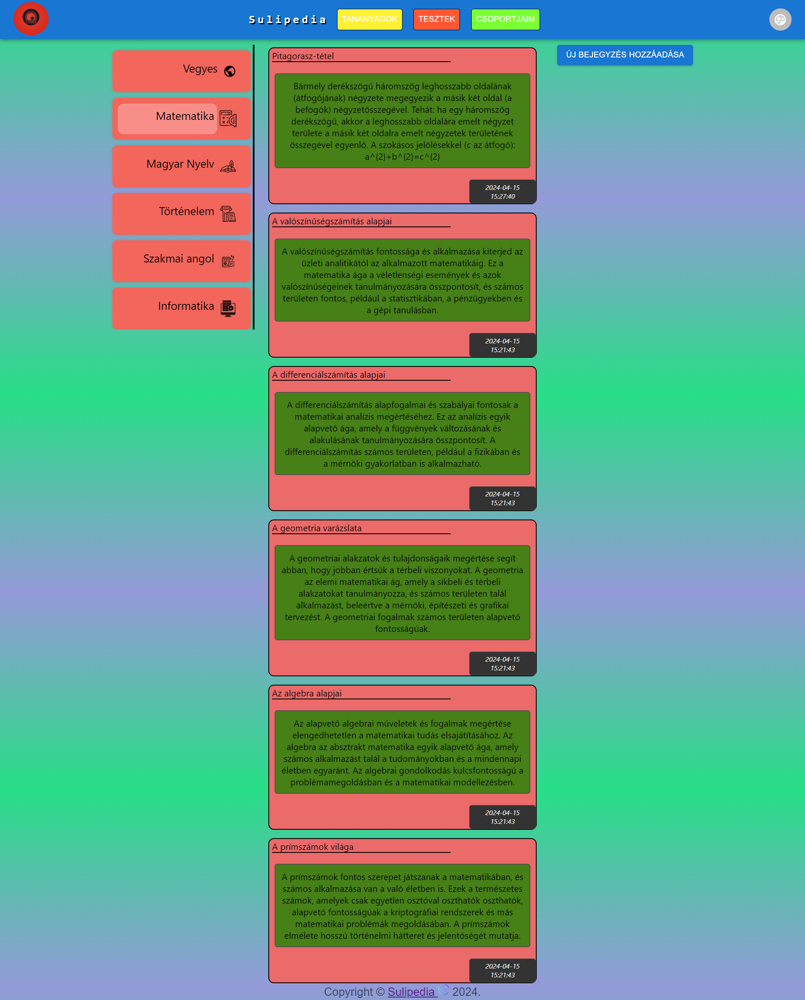
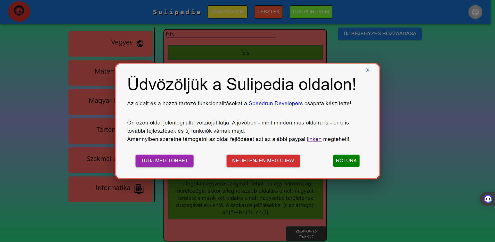

## Kezdő Oldal Felhasználói Dokumentáció

### Áttekintés

A LandingPage komponens az alkalmazás főoldalát jelenti, ahol a felhasználók üdvözölve vannak, és lehetőségük van bejegyzések megtekintésére és hozzáadására. Az oldal célja az alkalmazásba való belépés utáni első benyomás nyújtása, valamint az új tartalmak hozzáadásának lehetőségét biztosítja. Ezen kívül meg is tekithetik a korábbi bejegyzéseket.

---

### Használat

1. **Üdvözlő Modal Megjelenítése**: Az oldal betöltődésekor egy modal ablak jelenik meg, amely üdvözli a felhasználót, és lehetőséget ad a [további információk](LearnMoreFelhasznaloi.md) és az [oldal készítői](AboutUsFelhasznaloi.md)nek megtekintésére.
   
2. **Bejegyzések Megtekintése**: A fő tartalmi részben megjelennek a bejegyzések, amelyeket a felhasználók létrehoztak.

3. **Új Bejegyzés Hozzáadása**: A felhasználók lehetőséget kapnak új bejegyzések hozzáadására a főoldalon található gomb segítségével.

4. **Bejegyzések szürése**: A felhasználók lehetőséget kapnak a különböző kaegóriájú bejegyzések szűrésére az oldalon.

---

### Felhasználói Felület

A LandingPage felhasználóbarát felülettel rendelkezik, amely lehetővé teszi a könnyű és gyors navigációt az alkalmazás főbb tartalmai között. Az alábbiakban néhány jellemző a felhasználói felületről:

- **Üdvözlő Modal Ablak**: A modal ablakban üdvözölő üzenet, információk az alkalmazásról és navigációs gombok találhatók.

- **Bejegyzések Megjelenítése**: A fő tartalmi részben megjelennek a bejegyzések, amelyek tartalmazzák a címet, a tartalmat és a létrehozás dátumát.

- **Új Bejegyzés Hozzáadása**: A felhasználók egy gomb megnyomásával új bejegyzést adhatnak hozzá, és megadhatják annak címét, tartalmát és a hozzá tartozó tantárgyat.

---

### Fontos Megjegyzések

- A LandingPage komponens az alkalmazás főoldalát jelenti, és lehetőséget biztosít a felhasználóknak bejegyzések megtekintésére és hozzáadására.
- Használd az üdvözlő modal ablakot az alkalmazásba való belépés utáni első információk megszerzésére az oldal céljáról és készítőiről.
- Az új bejegyzés gomb segítségével a felhasználók könnyen és gyorsan hozzáadhatnak új tartalmakat az alkalmazáshoz.
- Az oldal bal oldlán található gombokkal a felhasználók könnyedén rá is szürhetnek a bejegyzésekre

