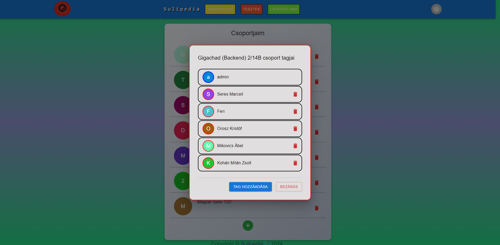
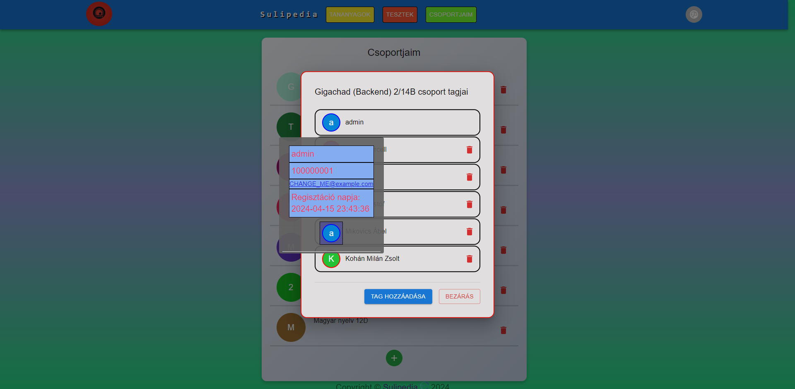

## Csoportjaim Komponens Felhasználói Dokumentáció

### Áttekintés

A MyGroups komponens lehetővé teszi a felhasználók számára, hogy csoportokat hozzanak létre, kezeljenek és tagjaikkal interakcióba lépjenek.

---

### Használat

1. **Csoportok Megtekintése**: Az oldal betöltésekor a felhasználók láthatják a már létező csoportjaik listáját. Minden csoport neve és leírása mellett található egy ikon, amelyre kattintva megjelenik a csoport tagjainak listája.

2. **Csoport Létrehozása**: Az "Új csoport létrehozása" gombra kattintva a felhasználók új csoportot hozhatnak létre. Ezt követően meg kell adniuk a csoport nevét, leírását és a csoport specializációit (több specializációt is kiválaszthatnak).

3. **Csoport Tagjainak Megtekintése**: A csoport nevére vagy az ikonjára kattintva megjelenik egy felugró ablak, amely a csoport összes tagját listázza. Minden tag mellett található egy törlés ikon, amely segítségével a csoport vezetője törölheti a tagot a csoportból. A tagok ikonjára kattinva megtekinthetők azok adatai.

4. **Csoport Tagjainak Hozzáadása**: A "Tag hozzáadása" gombra kattintva a csoport vezetője új tagokat adhat a csoportba. Ezt követően meg kell adnia a tag nevét.

5. **Csoporttagok elérhetősége és kapcsolattartás**: A csoporttagok láthatják, hogy más csoporttagok online vannak-e, valamint tudnak nekik e-mailt küldeni. Kék színnel az online, pirossal az offline állapot jelezve. 

---

### Fontos Megjegyzések

- A csoport vezetője jogosult új csoportok létrehozására és a csoport tagjainak kezelésére (hozzáadás és törlés).
- A csoport tagjai csak a csoport tagjainak listáját láthatják, és nem rendelkeznek jogosultsággal a csoport struktúrájának módosítására.

