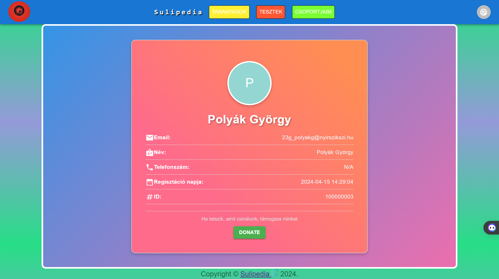

# Profilom Komponens Felhasználói Dokumentáció

## Áttekintés

A MyProfile komponens lehetővé teszi a felhasználó számára, hogy megtekintse saját profiladatait egy könnyen áttekinthető felhasználói felületen. A profil tartalmazza az alábbi információkat:

- **Profilkép**: Egy személyre szabott avatar kép, amely az első betűt mutatja a felhasználó vezetéknevéből..
- **Felhasználónév vagy Becenév**: A felhasználó beceneve, ha ez nincs, akkor neve.
- **E-mail cím**: A felhasználó regisztrált e-mail címe.
- **Telefonszám**: A felhasználó regisztrált telefonszáma (ha elérhető).
- **Regisztráció dátuma**: A felhasználó regisztrációjának dátuma.
- **Felhasználói azonosító**: Egyedi azonosító a felhasználó azonosításához.

## Használat

A MyProfile komponens automatikusan betölti és megjeleníti a felhasználó adatait, amint a felhasználó belép a rendszerbe.

