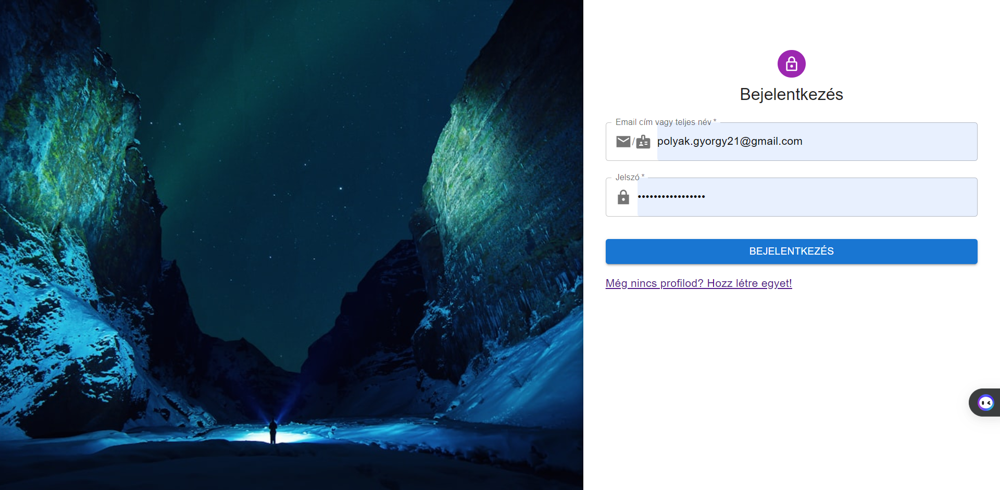

## Bejelentkezési Oldal Felhasználói Dokumentáció

### Áttekintés

A Bejelentkezési Oldal lehetővé teszi a felhasználók számára, hogy bejelentkezzenek a rendszerbe azáltal, hogy megadják az email címüket vagy a felhasználónevüket, valamint a jelszavukat. Az oldal egy biztonságos felületet biztosít a bejelentkezéshez, és felhasználóbarát dizájnnal rendelkezik.

---

### Használat

1. **Felhasználóazonosítás**: Az "Email cím vagy teljes név" mezőbe írd be az email címedet vagy a felhasználónevedet, amelyet a regisztrációkor megadtál.

2. **Jelszó Megadása**: A "Jelszó" mezőbe írd be a regisztrációkor megadott jelszavadat. A jelszó mező tartalmát csak te látod, így biztosíthatod a biztonságos bejelentkezést.

3. **Bejelentkezés**: Kattints a "Bejelentkezés" gombra a bejelentkezés folyamatának megkezdéséhez.

4. **Fiók Létrehozása**: Ha még nem regisztráltál, kattints a "Még nincs profilod? Hozz létre egyet!" linkre, hogy a [Regisztrációs Oldal](SignUpFelhasznaloi.md)ra navigálj, ahol létrehozhatod fiókodat.

---

### Felhasználói Felület

Az oldal felhasználóbarát felülettel rendelkezik, amely lehetővé teszi a könnyű és gyors bejelentkezést. Az alábbiakban néhány jellemző a felhasználói felületről:

- **Felhasználói Inputok**: Az email cím és jelszó mezők egyértelmű címkékkel rendelkeznek, amelyek segítik a felhasználókat a megfelelő adatok megadásában.

- **Biztonsági Elemek**: A bejelentkezési oldal azért készült, hogy biztonságosan tudj bejelentkezni. Ennek jelzésére az oldalon egy lakat ikon található, ami a biztonságos bejelentkezésre utal.

- **Hibakezelés**: Ha valamilyen hiba történik a bejelentkezés során (például helytelen jelszó vagy felhasználónév), a felhasználó értesítést kap arról, hogy mi volt a hiba oka.

- **Regisztrációhoz Navigáció**: Az oldalon lehetőség van a regisztrációra is, ha a felhasználó még nem rendelkezik fiókkal. Ehhez a "Még nincs profilod? Hozz létre egyet!" linkre kell kattintani.

- **Reszponzív Design**: Az oldal reszponzív dizájnja lehetővé teszi a használatát különböző eszközökön, például asztali számítógépeken, laptopokon, táblagépeken és mobiltelefonokon is.

### Fontos Megjegyzések
- Bejelentkezés után az oldal a [kezdő oldalra](LandingPageFelhasznaloi.md)ra navigál

