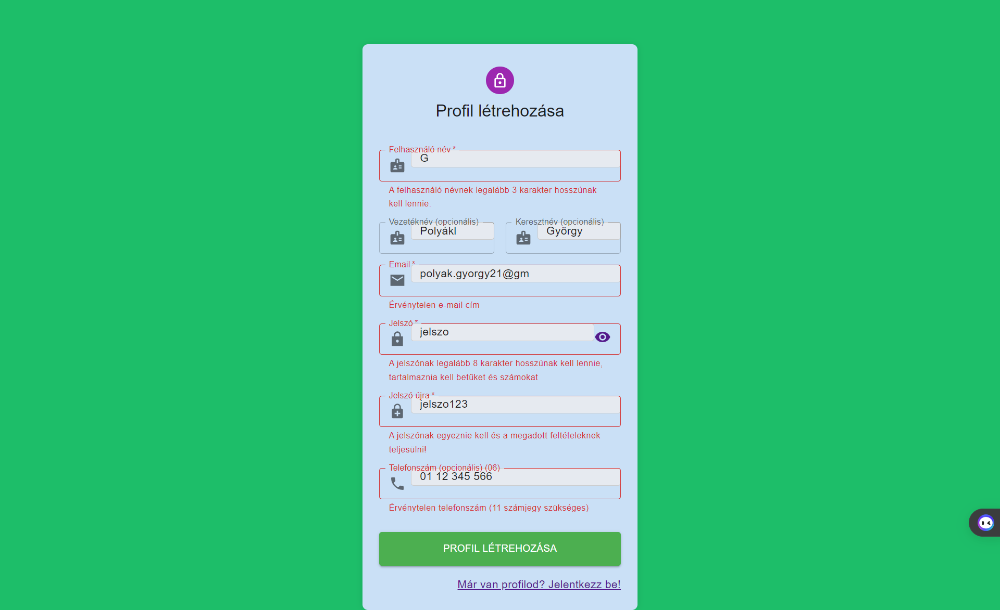
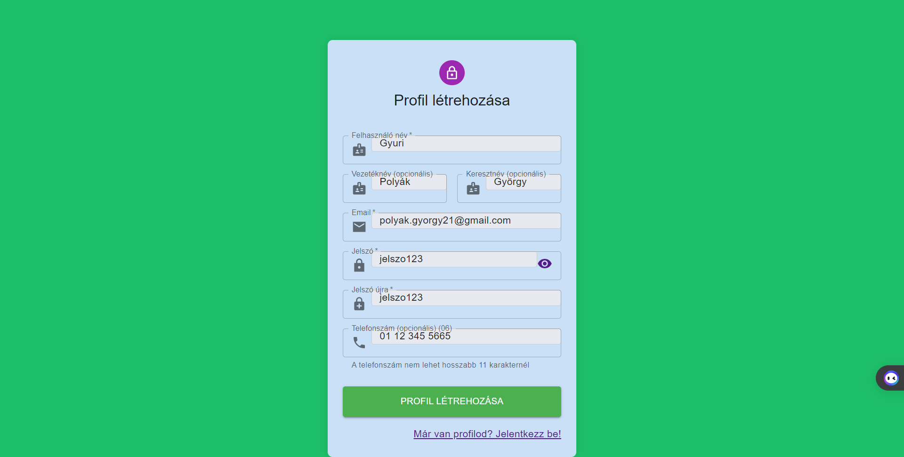

## Regisztrációs Oldal Felhasználói Dokumentáció

### Áttekintés

A Regisztrációs Oldal lehetővé teszi a felhasználók számára, hogy új profilt hozzanak létre a rendszerben. Az oldal segítségével a felhasználók könnyedén regisztrálhatnak, megadva a szükséges adatokat a fiók létrehozásához.

---

### Használat

1. **Adatok megadása**: Töltsd ki az összes kötelező mezőt, mint például a felhasználónév, email cím és jelszó.

2. **Telefonszám (opcionális)**: Opcionálisan megadhatod a telefonszámodat, amely segíthet azonosítani, kapcsolatba lépni veled.

3. **Becenév (opcionális)**: Opcionálisan megadhatod a becenevedet is.

4. **Vezeték- és Keresztnév (opcionális)**: Opcionálisan megadhatod a Vezeték- és Keresztnevedet is.

5. **Profil létrehozása**: Kattints a "Profil létrehozása" gombra a regisztráció befejezéséhez és az új fiók létrehozásához.

6. **Bejelentkezés**: Ha már van profilod, kattints a "Már van profilod? Jelentkezz be!" linkre a [SignInFelhasznaloi.md](bejelentkezési oldal)ra való navigáláshoz.

---

### Felhasználói Felület

Az oldal felhasználóbarát felülettel rendelkezik, amely lehetővé teszi a könnyű és gyors regisztrációt. Az alábbiakban néhány jellemző a felhasználói felületről:

- **Felhasználói Inputok**: Az összes mező egyértelmű címkékkel rendelkezik, ami segít a felhasználóknak az adatok helyes megadásában.

- **Biztonsági Elemek**: Az oldal az új profilt létrehozó felhasználókat biztonságos környezetben fogadja, és biztosítja, hogy a jelszavak megfelelően védettek legyenek.

- **Hibakezelés**: Ha valamilyen probléma merül fel a regisztráció során, az oldal értesítést jelenít meg a felhasználóknak a hibák okáról.

- **Bejelentkezésre Való Navigáció**: Az oldalon lehetőség van a bejelentkezésre is, ha a felhasználó már rendelkezik profillal. Ehhez a "Már van profilod? Jelentkezz be!" linkre kell kattintani.

- **Reszponzív Design**: Az oldal reszponzív dizájnja lehetővé teszi a használatát különböző eszközökön, például asztali számítógépeken, laptopokon, táblagépeken és mobiltelefonokon is.

---

### Fontos Megjegyzések

- Győződj meg róla, hogy minden kötelező mezőt kitöltöttél a regisztráció során.
- Győződj meg róla, hogy az email cím helyes formátumban van megadva.
- Győződj meg róla, hogy a jelszó elég erős és tartalmaz legalább egy betűt és egy számot.
- Ha telefonszámot adsz meg, győződj meg róla, hogy a számot a helyes formátumban adtad meg.

