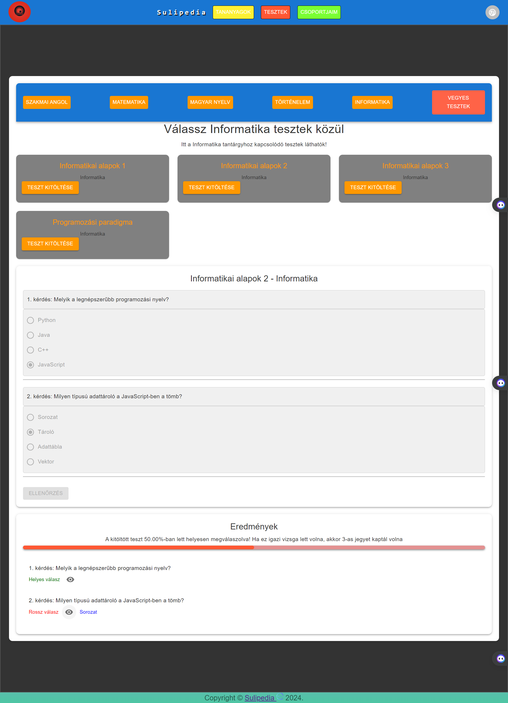

## Tests Komponens Felhasználói Dokumentáció

### Áttekintés

A `Tests` komponens lehetővé teszi a felhasználók számára, hogy különböző tantantárgyakhoz kapcsolódó teszteket töltsenek ki és ellenőrizzék az eredményüket. Az oldal felhasználóbarát felülettel rendelkezik, amely lehetővé teszi a könnyű navigációt és a tesztek gyors kiválasztását.

---

### Használat

1. **Tantárgy Kiválasztása**: Az oldal tetején található gombok segítségével válaszd ki a kívánt tantárgyat, amelyhez kapcsolódó teszteket szeretnél megtekinteni és kitölteni. A gombok alapján könnyen áttekinthetően láthatod, mely tantárgyakhoz érhető el teszt. A vegyes tesztek gombra kattintva minden teszt rendelkezésre áll.

2. **Teszt Kiválasztása**: Miután kiválasztottad a kívánt tantárgyat, a rendelkezésre álló tesztek listájában válaszd ki a számodra érdekes tesztet a cím alapján. Kattints a "Teszt kitöltése" gombra a teszt megkezdéséhez.

3. **Válaszadás**: A teszt során minden kérdés alatt található egy lista a válaszlehetőségekkel. Válaszd ki a szerinted helyes választ a kérdéshez.

4. **Ellenőrzés**: Ha befejezted a válaszadást, kattints az "Ellenőrzés" gombra, hogy megkapd az eredményedet és láthasd, mely kérdéseket válaszoltad helyesen. Az eredmények megtekintése után  visszajelzést kapsz arról, hogy mely kérdésekre adtál helyes vagy helytelen választ. A teszted sikerességét százalékosan és vonalként is láthatod.

---

### Fontos Megjegyzések
- Az eredmények megjelenése után láthatod, melyik kérdésre adtál helyes vagy helytelen választ, és visszajelzést kapsz az eredményedről.
- Az egyes kérdésekre adott helyes válaszokat csak az "Ellenőrzés" gomb megnyomása után tudod megtekinteni.

