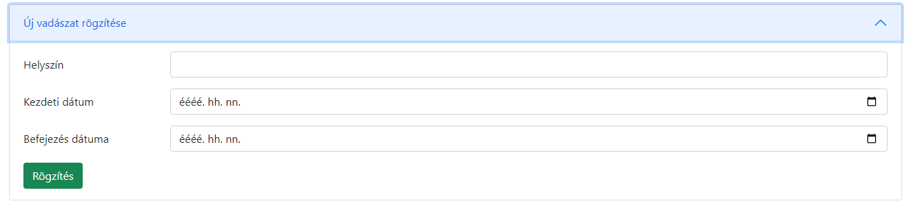
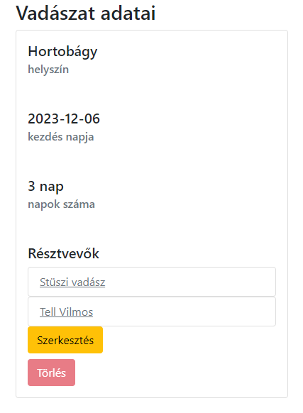
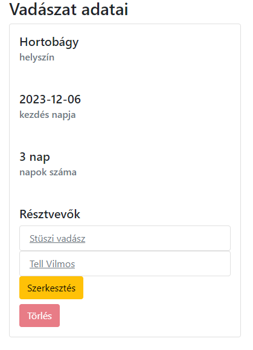

# Vadászatok kezelése - Funkcionális specifikáció

## Általános leírás

Alapfunkciók: Vadászatok lekérdezése és kezelése a rendszerben.

## Használati esetek

1. Vadászat lekérdezése
2. Vadászat módosítása
3. Vadászat helyszínének módosítása
4. Vadászat rögzítésa
5. Vadászatok listázása

### Használati eset diagram

### Használati esetek rövid leírása

| #                          | Vadászat adatainak megjelenítése                                                                                                   |
|----------------------------|------------------------------------------------------------------------------------------------------------------------------------|
| Azonosító                  | UC_H_Read                                                                                                                          |
| Leírás                     | Vadászat adatainak megjelenítése                                                                                                   |
| Kiváltó esemény            | A felhasználó meg kívánja nézni egy kiválasztott vadászat adatait                                                                  |
| Elsődleges lefutás         | A felhasználó a Vadászatok listázása felületen áll  Megnyomja a Részletek gombot   A rendszer lekérdezi a vadászat adatait |
| Alternatívák és kivételek  | E1: A keresett vadászat nem létezik.                                                                                               |
| Utófeltétel                | A rendszer lekérdezte a vadász adatait E1: A lekérdezés nem sikerült                                                           |
| Eredmény                   | A felhasználó látja a vadászat adatait                                                                                             |
| Használati eset realizáció | Technikai model                                                                                                                |

| #                          | Vadászat adatainak módosítása                                                                                                                                              |
|----------------------------|----------------------------------------------------------------------------------------------------------------------------------------------------------------------------|
| Azonosító                  | UC_H_Update                                                                                                                                                                |
| Leírás                     | Vadászat helyének, kezdés,- végidőpont módosítása                                                                                                                          |
| Kiváltó esemény            | A felhasználó meg kívánja váltosztatni valamelyik vadászat bizonyos vagy mindegyik adatát                                                                                  |
| Elsődleges lefutás         | A felhasználó a Vadászat szerkesztése felületen áll  Megadja a változtatni kívánt adatokat Megnyomja a Mentés gombot   A rendszer módosítja a vadászat adatait |
| Alternatívák és kivételek  | E1: A keresett vadász nem létezik.                                                                                                                                         |
| Utófeltétel                | A rendszer módosította a vadászat adatait E1: A módosítás nem sikerült                                                                                                 |
| Eredmény                   | A felhasználó látja a vadászat módosított adatait                                                                                                                          |
| Használati eset realizáció | Technikai model                                                                                                                                                        |

| #                          | Vadászat helyszínének módosítása                                                                                                                                         |
|----------------------------|--------------------------------------------------------------------------------------------------------------------------------------------------------------------------|
| Azonosító                  | UC_H_Update                                                                                                                                                              |
| Leírás                     | Vadászat helyének módosítása                                                                                                                                             |
| Kiváltó esemény            | A felhasználó meg kívánja váltosztatni a vadászat helyszínét                                                                                                             |
| Elsődleges lefutás         | A felhasználó a Vadászat szerkesztése felületen áll  Megadja a változtatni kívánt adatot Megnyomja a Mentés gombot   A rendszer módosítja a vadászat adatait |
| Alternatívák és kivételek  | E1: A keresett vadász nem létezik.                                                                                                                                       |
| Utófeltétel                | A rendszer módosította a vadászat adatait E1: A módosítás nem sikerült                                                                                               |
| Eredmény                   | A felhasználó látja a vadászat módosított adatát                                                                                                                         |
| Használati eset realizáció | Technikai model                                                                                                                                                      |

| #                          | Új vadászat rögzítése                                                                                                                             |
|----------------------------|---------------------------------------------------------------------------------------------------------------------------------------------------|
| Azonosító                  | UC_H_Create                                                                                                                                       |
| Leírás                     | Vadászat adatainak megadásával új vadászat rögzítése a rendszerben                                                                                |
| Kiváltó esemény            | A felhasználó új vadászatot kíván rögzíteni                                                                                                       |
| Elsődleges lefutás         | A felhasználó az új vadászat rögzítése felületen áll   Megadja az adatokat és megnyomja a mentés gombot   A rendszer rögzíti a vadászatot |
| Alternatívák és kivételek  | E1: A vadászat vége dátum hamarabb van mint a vadászat kezdete dátum                                                                              |
| Utófeltétel                | A vadászat sikeresen rögzítésre került a rendszerben E1: A rögzítés nem került végrehajtásra                                                  |
| Eredmény                   | A felhasználó az új vadászatot kezelni tudja                                                                                                      |
| Használati eset realizáció | Technikai model                                                                                                                               |

| #                          | Vadászat adatainak megjelenítése                                                                                                 |
|----------------------------|----------------------------------------------------------------------------------------------------------------------------------|
| Azonosító                  | UC_H_Read                                                                                                                        |
| Leírás                     | Vadászat adatainak megjelenítése                                                                                                 |
| Kiváltó esemény            | A felhasználó meg kívánja nézni egy kiválasztott vadászat adatait                                                                |
| Elsődleges lefutás         | A felhasználó a Vadászatok listázása felületen áll  Megnyomja a Részletek gombot   A rendszer lekérdezi a vadász adatait |
| Alternatívák és kivételek  | E1: A keresett vadászat nem létezik.                                                                                             |
| Utófeltétel                | A rendszer lekérdezte a vadászat adatait E1: A lekérdezés nem sikerült                                                       |
| Eredmény                   | A felhasználó látja a vadászat adatait                                                                                           |
| Használati eset realizáció | Technikai model                                                                                                              |

## Felületi terv

### Teljes design

* listázó
* megtekintő
* szerkesztő felületről

### Listázó felület

### Arculat

#### A felületen lévő mezők

| Mező neve        |     Típusa     | Szerkeszthető | Kötelező |
|:-----------------|:--------------:|---------------|----------|
| Helyszín         | Szöveges inupt | I             | I        |
| Kezdeti dárum    |  Dátum input   | I             | I        |
| Befejezési dátum |  Dátum input   | I             | I        |

#### A felületről elérhető műveletek

| Funkció                   |                                Esemény                                | Megjegyzés |
|:--------------------------|:---------------------------------------------------------------------:|-----------:|
| Rögzítás gombra kattintás | Végrehajtásra kerül az UC_H_Create, Vadász rögzítése használati eset. |          - |

#### A felületen lévő mezők

| Mező neve   |     Típusa      |
|:------------|:---------------:|
| Vadász neve | Táblázat oszlop |

#### A felületről elérhető műveletek

| Funkció                    |                                                                   Esemény                                                                    | Megjegyzés |
|:---------------------------|:--------------------------------------------------------------------------------------------------------------------------------------------:|-----------:|
| Részletek gombra kattintás | Végrehajtásra kerül az UC_H_Read, Vadászaz megjelenítése használati eset.  A frontend a Vadászat adatainak megjelenítése oldalra navigál |          - |

### Arculat

#### A felületen lévő mezők

| Mező neve          | Típusa |
|:-------------------|:------:|
| Vadászat helyszíne | Címke  |
| Kezdés napja       | Címkke |
| Napok száma        | Címke  |

#### A felületről elérhető műveletek

| Funkció                      |                       Esemény                        | Megjegyzés |
|:-----------------------------|:----------------------------------------------------:|-----------:|
| Szerkesztés gombra kattintás | A frontend a Vadászat szerkesztése oldalra navigál   |          - |

### Arculat

