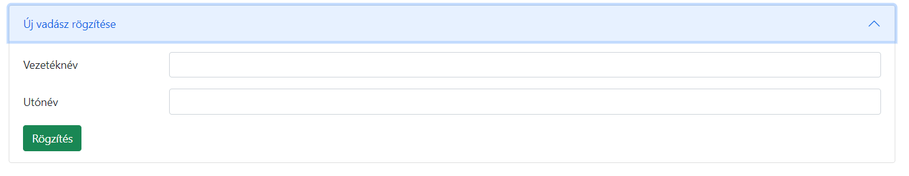
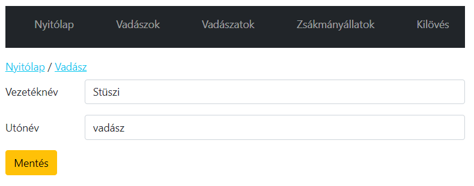

# Zsákmányok kezelése - Funkcionális specifikáció

## Általános leírás

Alapfunkciók: Zsákmányok rögzítése a rendszerbe. Zsákmányok adatainak kezelése.
Kiegészítő funkciók:

* Zsákmány rögzítése a lelövött vadak közé

## Használati esetek

1. Új zsákmány hozzáadása
2. Zsákmány adatainak megjelenítése (Pl madár, emlős)
3. Zsákmány szűrése
4. Zsákmányok listázása
5. Zsákmányok lekérdezése

### Használati eset diagram

### Használati esetek rövid leírása

| #                          | Új zsákmány hozzáadása                                                                                                                         |
|----------------------------|------------------------------------------------------------------------------------------------------------------------------------------------|
| Azonosító                  | UC_Q_Create                                                                                                                                    |
| Leírás                     | Vadász adatainak megadásával új vadász rögzítése a rendszerben                                                                                 |
| Kiváltó esemény            | A felhasználó új vadászt kíván rögzíteni                                                                                                       |
| Elsődleges lefutás         | A felhasználó az új vadász rögzítése felületen áll     Megadja az adatokat és megnyomja a mentés gombot   A rendszer rögzíti a vadászt |
| Alternatívák és kivételek  | E1: A felhasználó nem adott meg keresztnevet                                                                                                   |
| Utófeltétel                | A vadász sikeresen rögzítésre került a rendszerben E1: A rögzítés nem került végrehajtásra                                                 |
| Eredmény                   | A felhasználó az új vadászt kezelni tudja                                                                                                      |
| Használati eset realizáció | Technikai model                                                                                                                            |

| #                          | Zsákmány adatainak megjelenítése (Pl madár, emlős)                                                                             |
|----------------------------|--------------------------------------------------------------------------------------------------------------------------------|
| Azonosító                  | UC_Q_Read                                                                                                                      |
| Leírás                     | Vadász adatainak megjelenítése                                                                                                 |
| Kiváltó esemény            | A felhasználó meg kívánja nézni egy kiválasztott vadász adatait                                                                |
| Elsődleges lefutás         | A felhasználó a Vadászok listázása felületen áll  Megnyomja a Részletek gombot   A rendszer lekérdezi a vadász adatait |
| Alternatívák és kivételek  | E1: A keresett vadász nem létezik.                                                                                             |
| Utófeltétel                | A rendszer lekérdezte a vadász adatait E1: A lekérdezés nem sikerült                                                       |
| Eredmény                   | A felhasználó látja a vadász adatait                                                                                           |
| Használati eset realizáció | Technikai model                                                                                                            |

| #                          | Zsákmány szűrése                                                                                                                                                       |
|----------------------------|------------------------------------------------------------------------------------------------------------------------------------------------------------------------|
| Azonosító                  | UC_Q_Filter                                                                                                                                                            |
| Leírás                     | Vadász nevének módosítása                                                                                                                                              |
| Kiváltó esemény            | A felhasználó meg kívánja nézni egy kiválasztott vadász nevét                                                                                                          |
| Elsődleges lefutás         | A felhasználó a Vadász szerkesztése felületen áll  Megadja a változtatni kívánt adatokat Megnyomja a Mentés gombot   A rendszer módosítja a vadász adatait |
| Alternatívák és kivételek  | E1: A keresett vadász nem létezik.                                                                                                                                     |
| Utófeltétel                | A rendszer módosította a vadász adatait E1: A módosítás nem sikerült                                                                                               |
| Eredmény                   | A felhasználó látja a vadász módosított adatait                                                                                                                        |
| Használati eset realizáció | Technikai model                                                                                                                                                    |

| #                          | Zsákmányok listázása                                                                                                                       |
|----------------------------|--------------------------------------------------------------------------------------------------------------------------------------|
| Azonosító                  | UC_HR_Delete                                                                                                                         |
| Leírás                     | Vadász törlése a rendszerből                                                                                                         |
| Kiváltó esemény            | A felhasználó törölni kívánja a kiválasztott vadászt                                                                                 |
| Elsődleges lefutás         | A felhasználó a Vadász szerkesztése felületen áll  Megnyomja a törlés gombot  A rendszer törli a vadászt                     |
| Alternatívák és kivételek  | E1: A vadász már jelentkezett valamelyik vadászatra E2: A vadász már lőtt állatot E3: A keresett vadász nem létezik          |
| Utófeltétel                | A vadász törlésre került E1: a vadász törlése sikertelen E2: a vadász törlése sikertelen E3. a vadász törlése sikertelen |
| Eredmény                   | A felhasználó nem éri el a vadászt                                                                                                   |
| Használati eset realizáció | Technikai modell                                                                                                                     |

| #                          | Zsákmányok lekérdezése                                                       |
|----------------------------|--------------------------------------------------------------------------|
| Azonosító                  | UC_HR_List                                                               |
| Leírás                     | Vadász listázása                                                         |
| Kiváltó esemény            | A felhasználó meg kívánja tekínteni az összes vadászt                    |
| Elsődleges lefutás         | Megnyomja a Vadászok menügombot  A rendszer kiválogatja a vadászokat |
| Alternatívák és kivételek  | -                                                                        |
| Utófeltétel                | A Vadászok lekérdezére kerültek a rendszerben                            |
| Eredmény                   | A felhasználó átja a Vadászok adatait                                    |
| Használati eset realizáció | Technikai modell                                                         |

## Felületi terv

### Teljes design

ide jön kép:

* listázó
* megtekintő
* szerkesztő felületről

### Listázó felület

### Arculat

#### A felületen lévő mezők

| Mező neve  |     Típusa     | Szerkeszthető | Kötelező |
|:-----------|:--------------:|---------------|----------|
| Vezetéknév | Szöveges inupt | I             | I        |
| Utónév     | Szöveges input | I             | N        |

#### A felületről elérhető műveletek

| Funkció                    |                                Esemény                                 | Megjegyzés |
|:---------------------------|:----------------------------------------------------------------------:|-----------:|
| Részletek gombra kattintás | Végrehajtásra kerül az UC_HR_Create, Vadász rögzítése használati eset. |          - |

#### A felületen lévő mezők

| Mező neve   |     Típusa      |
|:------------|:---------------:|
| Vadász neve | Táblázat oszlop |

#### A felületről elérhető műveletek

| Funkció                    |                                                                  Esemény                                                                  | Megjegyzés |
|:---------------------------|:-----------------------------------------------------------------------------------------------------------------------------------------:|-----------:|
| Részletek gombra kattintás | Végrehajtásra kerül az UC_HR_Read, Vadász megjelenítése használati eset.  A frontend a Vadász adatainak megjelenítése oldalra navigál |          - |

### Megtekintő felület

### Arculat

#### A felületen lévő mezők

| Mező neve   | Típusa |
|:------------|:------:|
| Vadász neve | Címke  |

#### A felületről elérhető műveletek

| Funkció                      |                                                                Esemény                                                                | Megjegyzés |
|:-----------------------------|:-------------------------------------------------------------------------------------------------------------------------------------:|-----------:|
| Törlés gombra kattintás      | Végrehajtásra kerül az UC_HR_Delete, Vadász törlése használati eset.  A frontend a Vadász listázója megjelenítése oldalra navigál |          - |
| Szerkesztés gombra kattintás |                                           A frontend a Vadász szerkesztése oldalra navigál                                            |          - |

### Szerkesztő felület

### Arculat

#### A felületen lévő mezők

| Mező neve  |       Típusa        | Értékkészlet | Kötelező | Szerkeszthető |
|:-----------|:-------------------:|:------------:|:--------:|:-------------:|
| Vezetéknév | Szöveges input mező |      -       |    I     |       I       |
| Utónév     | Szöveges input mező |  férfi, nő   |    N     |       I       |

#### A felületről elérhető műveletek

| Funkció                 |                                                                 Esemény                                                                 |                                     Megjegyzés |
|:------------------------|:---------------------------------------------------------------------------------------------------------------------------------------:|-----------------------------------------------:|
| Mentés gombra kattintás | Végrehajtásra kerül az UC_HR_Update, Vadász módosítási használati eset.  A frontend a Vadász listázója megtekintése oldalra navigál | Amíg az űrlap nem valid, addig a gomb Disabled |
